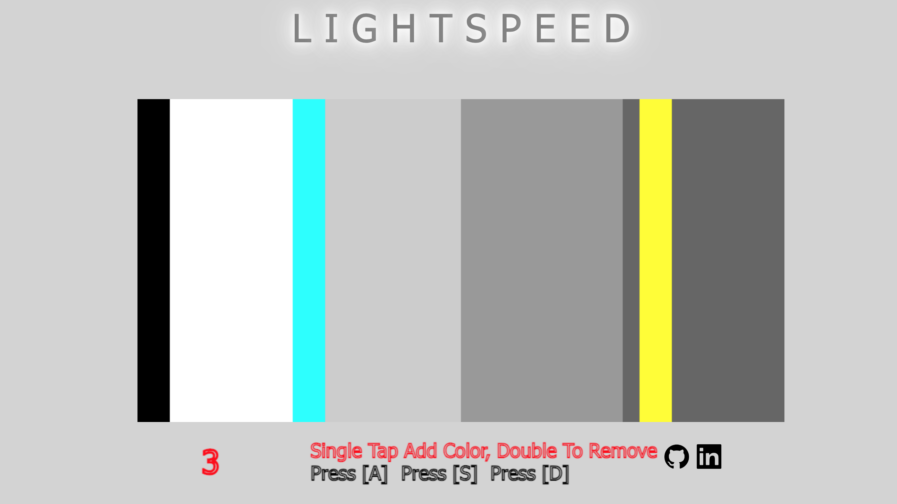
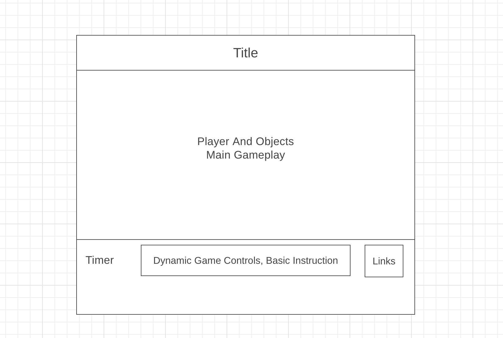

LightSpeed is a game of color mixing. A player is given three color options, red, green and blue assigned to the a, s, and d keys respectively. 

The player must combine two colors to get an incoming color before it collides with the player. The game score is based off of time. The longer the player survives the higher the score and the faster the colors approach.

Functionality & MVPs
------

In LightSpeed, users will be able to:
     
 * Play as a color object
 * Mix colors
 * Match colors of incoming objects
 * Play at increasing speed with more obstacles as they progress
* Increase their time as they progress through the plane

Wireframes
------

* Click will be used to start and reset the game
* Nav links include links to this project's Github repo and my LinkedIn 
* Game controls will include keyboard inputs from letters A, S, D as the colors red, green and blue respectivley. These inputs will allow the player to mix colors in realtime and change the color of their object.

Technologies, Libraries, APIs
------
Most of the code is written in vanilla Javascripts, the resources below were used to manage the project and better implement design.

* Webpack and Babel to bundle and transpile the source JavaScript code
* Canvas, primary resource to build game board and help render animations. Great for implementing 2D mechanisms
* npm to manage project dependencies

Feature Implementation:
--
#
This key bind specifically for attaching A, S and D to an keydown even that would flip the state and allow a player to switch between one of the primary colors
---

    keyBind() {
        document.addEventListener("keydown", (e) => {
            console.log(e)
            console.log(e.code)
            if (["KeyA", "KeyS", "KeyD"].includes(e.code)) {
                const valSign = this.keyStates[e.code] ? -1 : 1;
                this.keyStates[e.code] = !this.keyStates[e.code];

                this.changeColor(e.code, valSign);
            }

    });
}

#
 This object to store key states and its color values as independent inputs
---

        
    this.keyStates = {
        KeyA: false,
        KeyS: false,
        KeyD: false
    };

    this.keyBind();

    this.colors = {
        r: 0,
        g: 0,
        b: 0
    }

Future Implementations:
----

* Choose a theme, to change the game colors
* Increase difficulty by flashing the obstacle colors instead of a static color.
* Zen mode, a circle track where you can’t loose and simply gain points by mixing
the right upcoming colors
* A colorblind mode that uses shapes or numbers instead of color

